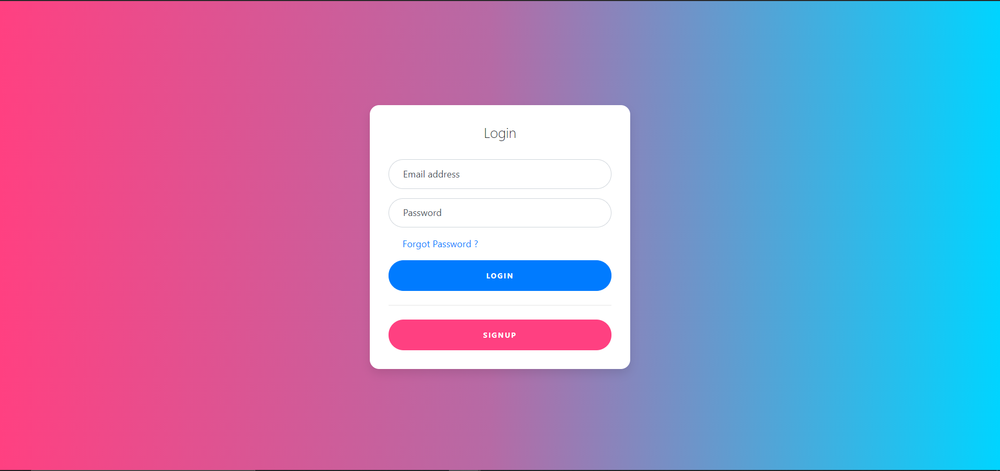
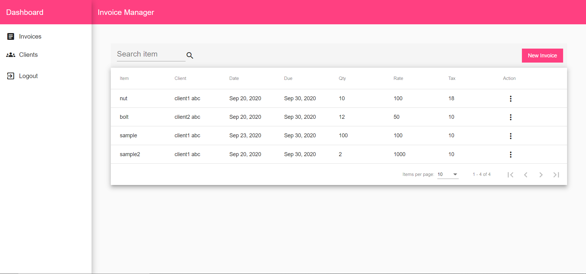
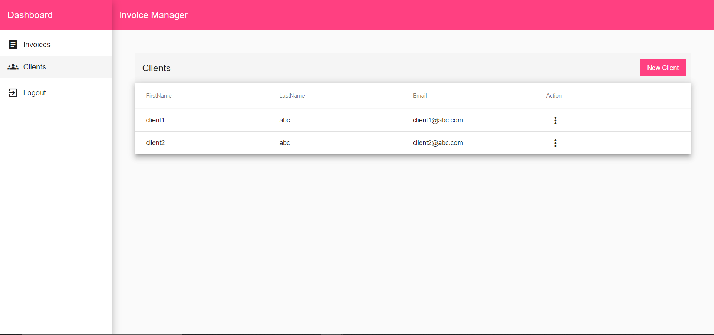
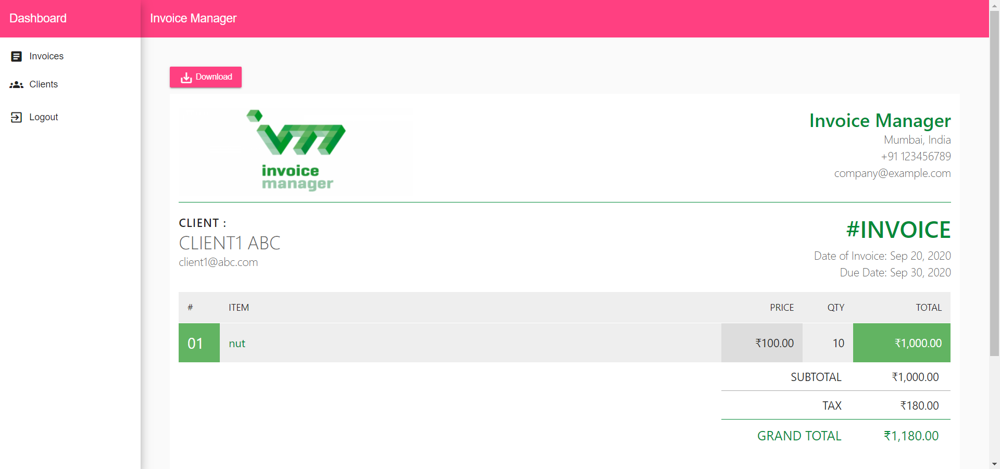

 <div align="center">

# Invoice Manager

[](https://angular.io/docs)
[](mongodb.com "MongoDB")
[](https://code.visualstudio.com/ "Visual Studio Code")
[](https://www.heroku.com/ "Heroku")

</div>

Manage your clients and invoices at one place.
MEAN Stack mini-project


## Deployed website

[https://invoicemanager2.herokuapp.com/](https://invoicemanager2.herokuapp.com/)

## Features

- SignUp / SignIn.
- Forgot / Reset password.
- create / edit / delete Clients.
- create / edit / delete Invoices.
- View and Download invoice in pdf format.

## Demo

<div align="center">

<!-- <h4 align="center">Auth Page</h4> -->

<br>

<br>

<br>

<br>

</div>

## To run the project locally

* clone this Repository by `git clone https://github.com/shahshubh/Invoice-Manager.git`.
* In /src/environments/environment.ts file change
    ```
    production: false,
    apiUrl: 'https://invoicemanager2-server.herokuapp.com/api'
    ```
* Run the following in terminal in sequence
    - `cd Invoice-Manager`
    - `npm install`
    - `ng s`
* Open your browser and enter url `http://localhost:4200`

## Tech Stack

```
MEAN Stack

- MongoDB
- Express
- Angular
- Nodejs
```

## Stargazers
[](https://github.com/shahshubh/Invoice-Manager/stargazers)

<br/>
<p align="center"><a href="https://github.com/shahshubh/Invoice-Manager#"></a></p>